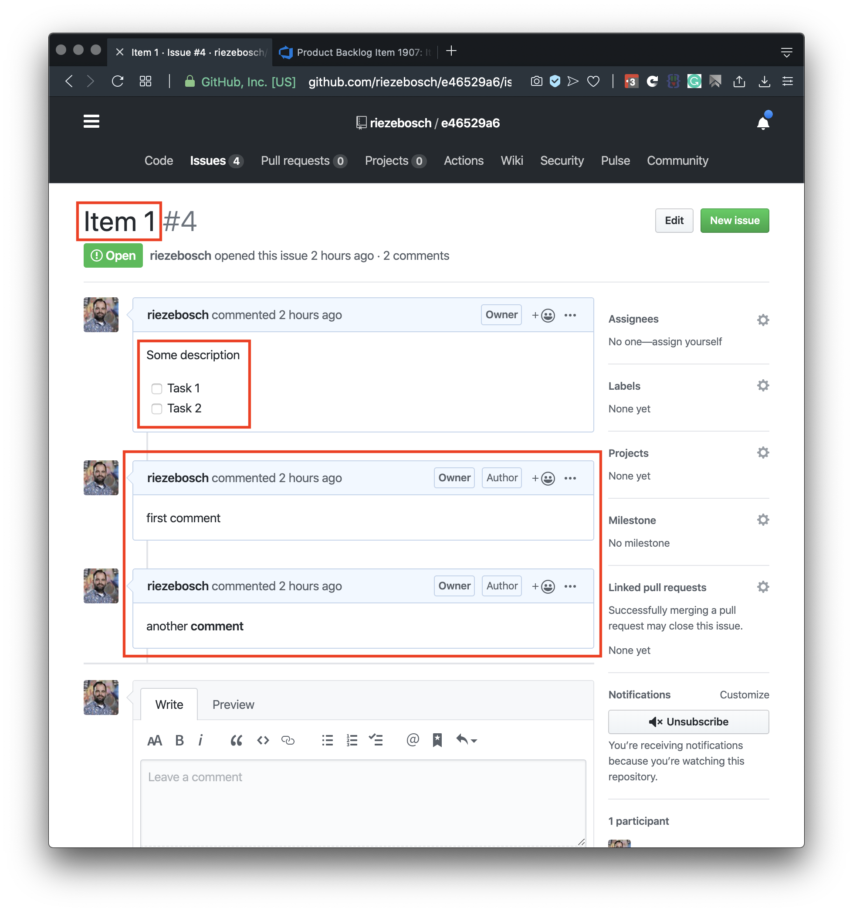

# Azure DevOps ⇒ GitHub

This is the very beginning of Azure DevOps to GitHub migration tooling.

## Flatten backlog

All _open_ Product Backlog Items are converted into issues.

Related Tasks are converted into a task list and added to the description of the issue:

## What cannot be done

Due to the nature of issues on GitHub it is:

- impossible to create an hierarchical backlog
- replay the history of or backdate items 
- impersonate the original author

Therefor it is useless as an audit trail and should not be used for that.

## Free demo!

Try it out and [import](https://riezebosch.github.io/azdev2gh) the first 50 PBI's into a temporary repository!
