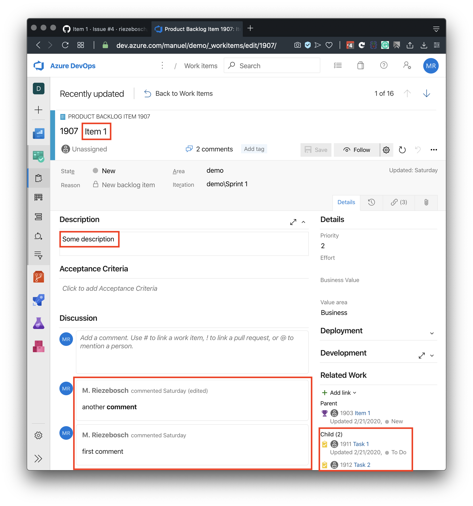

# Azure DevOps ⇒ GitHub

This is the very beginning of Azure DevOps to GitHub migration tooling. 

## Flatten backlog

All *open* Product Backlog Items are converted into issues.

Related Tasks are converted into a task list and added to the description of the issue:

Try it out and [import](https://riezebosch.github.io/azdev2gh) the first 50 PBI's into a temporary repository!